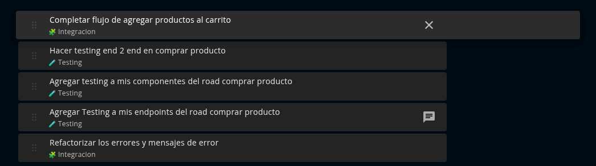

# Kiosco

Sistema de gestión para ventas minoristas y tiendas de abarrotes. Actualmente en desarrollo, enfocado en facilitar el control de ventas, productos y operaciones diarias.

## 📝 Descripción

Kiosco es una aplicación web diseñada para pequeños negocios, como kioscos o tiendas de abarrotes. Permitirá administrar productos, registrar ventas y llevar un control básico del inventario.

 

## 🛠️ Tecnologías Utilizadas

- **React** (base del frontend)
- **Typescript** (tipado)
- **Bootstrap** (estilos y componentes UI)
- **Mui** (componentes UI)

> _Se irán agregando nuevas tecnologías y herramientas a medida que el proyecto avance._

🏛️ Arquitectura – Screaming Architecture

Este proyecto sigue los principios de Screaming Architecture, donde la estructura está orientada al dominio y no a las tecnologías.

📂 Estructura del Proyecto
src/<br>
├── app/     # Configuración de rutas, layout principal y providers globales<br>
├── auth/     # Módulo de autenticación y autorización<br>
├── core/     # Configuración global, servicios base, helpers<br>
├── inventory/ # Lógica y pantallas de inventario (stock, almacenes)<br>
├── products/ # Gestión de productos (CRUD, categorías, precios)<br>
├── sales/ # Ventas, tickets y reportes<br>
├── shared/ # Componentes y utilidades reutilizables<br>
├── users/ # Gestión de usuarios y roles<br>
├── assets/ # Imágenes y recursos estáticos<br>
└── main.tsx # Punto de entrada<br>
<br>
🗂️ Estructura Interna por Módulo<br>
products/<br>
├── components/ # Componentes UI específicos del dominio<br>
├── pages/ # Pantallas o rutas del módulo<br>
├── hooks/ # Custom hooks del dominio<br>
├── services/ # Lógica de datos / API<br>
└── types/ # Modelos y tipados<br>
<br>
## 🚧 Estado del Proyecto

**En desarrollo** – Actualmente se están construyendo las primeras funcionalidades y estructura inicial.

## 📦 Instalación y Uso

```bash
# Clonar el repositorio
git clone https://github.com/usuario/kiosco.git

# Instalar dependencias
yarn

# Iniciar el entorno de desarrollo
yarn dev
```
## 📦 Instalacion en ubuntu

# Instalar yarn
sudo npm install -g yarn
# Instalacion NVM
curl -o- https://raw.githubusercontent.com/nvm-sh/nvm/v0.39.7/install.sh | bash
cerrar terminal
# Instalacion Node 20 o superior
nvm install 20
nvm use 20

## ✨ Características (Planeadas)

- Registro y listado de productos
- Control de ventas diarias
- Gestión básica de inventario
- Interfaz simple y responsive

## ✔️🏗️🚧 Gestión de tareas y progreso 🗞️

Este proyecto utiliza un sistema de checklist y categorización para organizar el avance técnico.  
Cada tarea se registra con:

 

 

🧭 Las tareas se actualizan al finalizar cada bloque funcional o sprint.  
🎬 El objetivo es mantener trazabilidad clara, expresiva y útil para onboarding técnico.


## 📅 Roadmap Futuro

- Integración con base de datos (Firebase / Supabase / MongoDB)
- Reportes de ventas y estadísticas
- Autenticación de usuarios

## 👤 Autor

Desarrollado por **Lautaro Cantero**

_Este README se actualizará a medida que el proyecto avance._
