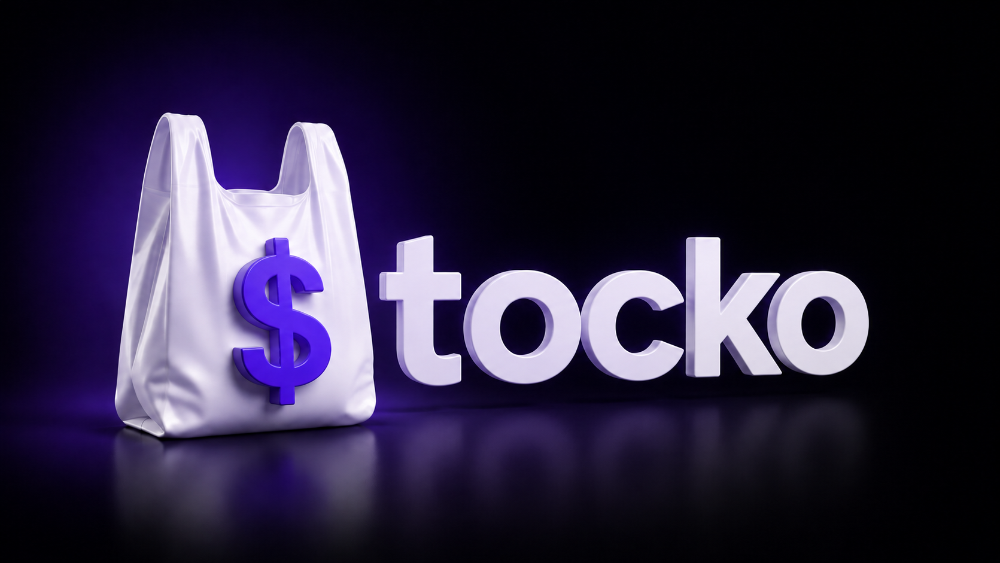

# Stoko

Sistema de gestión para kioscos y comercios minoristas. Aplicación web construida con React, TypeScript y Vite para administrar productos, ventas, proveedores y clientes.

## 📝 Descripción

Stoko es una plataforma de administración para negocios pequeños, enfocada en:
- **multi-kiosco**: cada usuario puede crear su propio kiosco o unirse a uno existente vía código de invitación, y pertenecer a varios kioscos a la vez — productos, presentaciones, proveedores, ventas y vendedores quedan completamente aislados por kiosco (ver [docs/features/multiKiosco.md](docs/features/multiKiosco.md))
- registro y edición de productos y presentaciones
- gestión de proveedores
- control de ventas y carrito de venta
- panel administrativo y métricas
- autenticación de usuarios con Google OAuth y flujos de registro/login


## 🧩 Tecnologías principales

- **React 19**
- **TypeScript**
- **Vite**
- **Redux Toolkit** + **redux-persist**
- **React Router v7**
- **MUI (Material UI)**
- **Formik** + **Yup / Zod**
- **Dayjs**
- **jsPDF**
- **Google OAuth**
- **animate.css**

## 📁 Estructura principal del proyecto

- `src/main.tsx` — punto de entrada
- `src/StokoApp.tsx` — providers globales y tema
- `src/router/AppRouter.tsx` — rutas principales y control de acceso
- `src/config/` — constantes y configuración de API
- `src/store/` — Redux slices, thunks y store persistente
- `src/theme/` — configuraciones de tema claro/oscuro
- `src/modules/` — funcionalidades por dominio
- `src/hooks/` — hooks personalizados reutilizables
- `src/typings/` — definiciones de tipos compartidos
- `src/utils/` — utilidades y formateadores

### Módulos relevantes

- `src/modules/auth/` — login, registro, recuperación de contraseña y verificación
- `src/modules/kiosco/` — selección/creación/unión a kioscos (multi-tenant), invitaciones
- `src/modules/account/` — gestión de perfil y suscripción
- `src/modules/sells/` — ventas, nuevo ticket, detalle de venta
- `src/modules/cart/` — carrito de venta y confirmación de pedido
- `src/modules/products/` — listado, creación, edición y detalle de productos
- `src/modules/presentations/` — gestión de presentaciones/variantes de producto
- `src/modules/providers/` — administración de proveedores
- `src/modules/shop/` — administración de tienda, vendedores y estadísticas
- `src/modules/shared/` — layout, componentes comunes y notificaciones

## 🚀 Funcionalidades actuales

- Multi-kiosco: crear/unirse a kioscos, cambiar de kiosco activo, invitar vendedores por link
- Rutas protegidas para usuarios autenticados (y sin kiosco activo)
- Persistencia de sesión y de kiosco activo con `redux-persist`/`localStorage`
- Soporte de tema claro/oscuro
- Flujo completo de autenticación y registro
- Carrito de ventas con ticket de confirmación
- Gestión de productos, presentaciones y proveedores (scoped por kiosco)
- Páginas de administración para vendedores, tiendas y roles (rol por-kiosco)

## 📦 Scripts disponibles

```bash
yarn dev
yarn build
yarn preview
yarn lint
yarn test
```

## 🔧 Instalación local

1. Instalar Node.js 20+ y Yarn
2. Clonar el repositorio

```bash
git clone <repo-url>
cd KioscoApp
yarn
```

3. Crear un archivo `.env` con variables necesarias:

```env
VITE_GOOGLE_CLIENT_ID=your-google-oauth-client-id
VITE_API_URL=https://api.example.com
```

4. Ejecutar en modo desarrollo:

```bash
yarn dev
```


## 📚 Documentación adicional

Toda la documentación técnica vive en [`docs/`](docs/) — no hay documentación en ningún otro directorio del repo:

- `docs/features/` — features completos (multi-kiosco, dashboard de `/shop`, theme, notificaciones, roles, etc.)
- `docs/hooks/` — un archivo por hook custom, organizado por dominio
- `docs/store/` — slices y thunks de Redux
- `docs/components/` — componentes reusables no triviales
- `docs/schema/` — esquemas de validación (Yup/Zod)
- `docs/helpers/` — funciones puras
- `docs/usefull/` — tareas y notas internas

## 🛠️ Estado del proyecto

**En desarrollo** — la aplicación ya cuenta con la estructura de dominio, rutas y módulos principales. El foco actual está en completar los flujos de ventas, productos, presentaciones y administración.

## 👤 Autor

Desarrollado por **Lautaro Cantero**

> Este README refleja la estructura actual del proyecto y puede seguir actualizándose conforme se avance en nuevas funcionalidades.

